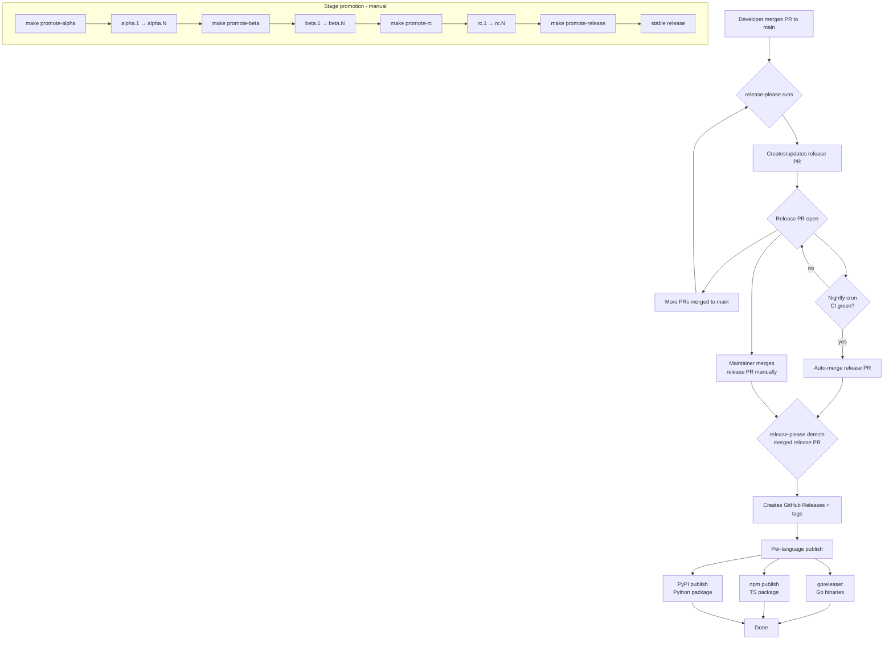

# Releasing

## Unreleased

### Engine SDK and `kit serve` protocol reconciliation

The engine wire protocol (`docs/engine-protocol.md`), the Go
reference server (`cmd/kit/serve.go`), the TypeScript SDK
(`engine/sdk/ts-kit-engine`), and the Python SDK
(`engine/sdk/py-kit-engine`) now all describe the SAME contract.
Per-row protocol-of-record decisions are in
[ADR-0018](adr/0018-engine-sdk-protocol-reconciliation.md);
the input audit is [`docs/contributors/audits/engine-sdk-drift.md`](audits/engine-sdk-drift.md).

Cross-SDK parity is locked by the integration test under
`engine/sdk/parity` (T-0390), which runs the same
create/update/history/revert workload through both SDKs against
one `kit serve` and asserts identical observable behavior.

#### Breaking changes — TypeScript SDK (`@hop-top/kit-engine`)

- History route renamed: `engine.collection(t).history(id)` now
  hits `GET /:type/:id/history` (was `/versions`) and unwraps the
  `{versions:[...]}` envelope.
- Revert body shape: `revert(id, version)` now sends
  `POST /:type/:id/revert` with body `{"version":N}` (was a path
  param).
- Sync status: `engine.sync.status()` now hits `/sync/status` (was
  `/sync/remotes`); the older path still exists but only lists
  remotes.
- Identity getter: `engine.identity.publicKey()` now hits
  `/identity` (was `/identity/key`); the response surfaces
  `{id, fingerprint, public_key}`.
- Identity verify: `engine.identity.verify(data, signature)` now
  sends `{data, signature}` (base64) instead of `{token}`.
- Auth-token propagation: bearer token is sent on every mutating
  call (collection mutations, sync, peers, identity, shutdown);
  previously only `stop()` carried the token.
- New surface: branch / fork / merge routes on
  `engine.collection(t)`, prune / abandon / live-branches on the
  same client. Previously absent.

Migration: bump to the new package version; if you were calling the
old routes through `engine.fetch(...)` directly, swap to the typed
methods. Auth callers who sent the bearer token manually should
now let the SDK handle it.

#### Breaking changes — Python SDK (`hop-top-kit-engine`)

- Same history/revert/identity changes as the TS SDK.
- Sync surface reshaped: `engine.sync.add_remote(...)`,
  `engine.sync.push(name)`, `engine.sync.pull(name)`,
  `engine.sync.status()`. The previous `engine.sync.trigger(...)`
  helper hit a route (`/sync/trigger`) that the server never
  exposed; remove those calls.
- Peers: `engine.peers.connect(...)` — never wired server-side —
  was removed; use `engine.peers.trust(id)` /
  `engine.peers.block(id)` instead.
- Identity: the unsupported `engine.identity.set(...)` was
  removed; use `engine.identity.verify(data, signature)`.
- Auth-token propagation as in the TS SDK: bearer token now flows
  through every mutating call.

Migration: bump to the new package version; replace any
`sync.trigger`, `peers.connect`, or `identity.set` calls with the
new equivalents.

#### Breaking changes — `kit serve`

- `/health` response now includes `pid` and `uptime_seconds`
  alongside `status`.
- `/shutdown` now returns `204 No Content` (was `200` + JSON).
- `/peers/:id/{trust,block}` now return `204` (was `200` + JSON).
- Error envelopes now follow the doc shape
  `{"status":N,"code":"…","message":"…"}` instead of the legacy
  `{"error":"…"}`; SDKs continue to surface host-language
  exceptions.
- Sync push response now reports `{accepted:N, rejected:N}`
  counts (was a boolean).

Direct HTTP consumers that hand-rolled the old shapes need to
update; both kit SDKs are already conformant.

### Bus topic builder + Qualifiers payload (`go/runtime/bus`)

`runtime/bus` formalizes its 4-segment topic grammar and adds a
typed construction path. New surface:

- `bus.TopicOf(source, category, object).Mod(modifier).Action(action)`
  — chainable builder that validates on `Action(...)`. The
  optional `Mod` joins a snake_case modifier into the Object
  segment with `_` so sub-classified objects stay one segment on
  the wire (`kit.config.snapshot_reload.failed`).
- `bus.PrefixedTopicOf(source, category, object, modifier...)` —
  shorthand for the common case where source/category/object are
  fixed.
- `bus.ParseTopic(s) (TopicBuilder, action, error)` — inverse;
  splits the Object segment on the first underscore so any
  builder-produced topic round-trips to an equivalent builder.
- `bus.Qualifiers` — payload-side struct with optional
  `Reason`, `Mechanism`, `Property`, `Circumstance` fields (all
  `omitempty`). Embed it (anonymous or named) in event payloads
  that distinguish via these axes; `bus.QualifiersFrom(payload any)`
  extracts via reflection.

The pre-existing `Validate`, `ValidateTopic`, `Mode` (off / warn /
strict), `KIT_BUS_ENFORCE` env, `WithEnforce`, and `ModeFromConfig`
are unchanged. The builder uses `ValidateTopic` (the stricter
past-tense path).

**Why no sigil notation on the wire** — `?reason`, `+mechanism`,
etc. were considered and rejected. Topics are routing keys;
encoding semantic qualifiers there explodes the routing tree,
fragments metric series, and breaks pinned subscribers when a new
qualifier appears. Qualifiers belong in the payload.

See [ADR-0017](adr/0017-bus-topic-naming-and-qualifiers.md)
and [docs/contributors/contracts/event-topics.md](contracts/event-topics.md).

### Signal-driven hot reload for `core/config`

`go/core/config` adds `Reloadable[T]`, an atomic-snapshot wrapper
that supports re-running `Load(&newCfg, opts)` without restarting
the process. Reload partitions struct fields into mutable vs
immutable via a `reload:"true"` tag (default = immutable); changes
to immutable fields are vetoed and the live snapshot is left
untouched.

New surface:

- `config.New[T](initial *T, opts Options, pub EventPublisher) *Reloadable[T]`
- `(*Reloadable[T]).Snapshot() *T` — readers always go through
  this; the underlying pointer is `atomic.Pointer[T]` so there are
  no torn reads during a swap.
- `(*Reloadable[T]).Reload(newOpts Options) error` — re-loads;
  returns `ErrImmutableChanged` (a structured error listing
  offending paths) if any non-tagged field differs.
- `config.WatchSignal(ctx, sig)` — spawns a goroutine that calls
  `Reload(currentOpts)` on every signal delivery. Use any signal
  (`SIGHUP`, `SIGUSR1`, etc.) — the API takes `os.Signal`.
- `config.Partition[T](v *T)` — exported helper; cached per type
  via `sync.Map` keyed on `reflect.Type`. Embedded structs
  traverse recursively.

Bus events (use the existing `domain.EventPublisher` shape):

| Topic | When | Payload shape |
|-------|------|---------------|
| `kit.config.snapshot.reloaded` | reload swapped successfully | `ReloadedPayload` (mutable diff + source paths) |
| `kit.config.snapshot.reload_failed` | reload vetoed or `Load` failed | `ReloadFailedPayload` (reason + offending paths + error) |

See [ADR-0016](adr/0016-config-signal-driven-hot-reload.md)
and `go/core/config/README.md`.

### `WallClock` interface for deterministic tests (`runtime/sync`)

`go/runtime/sync` adds a `WallClock` interface separate from the
existing HLC `Clock` (which produces `Timestamp` values for causal
ordering). The new interface makes `time.Now()` injectable so HLC
tests can pin physical time:

- `WallClock` — single-method interface, `WallTime() time.Time`.
- `SystemWallClock` (and the package-level `System` value) — calls
  `time.Now()`. Default behaviour.
- `FixedClock(t)` — always returns `t`. For deterministic tests.
- `NewMockWallClock(start) *MockWallClock` — mutable; `Advance(d)`
  shifts the held time by `d`. Mutex-guarded; race-clean.

HLC `Clock` now has a non-breaking `NewClockWithWallClock(nodeID, WallClock)`
constructor; existing `NewClock(nodeID)` keeps wall-time semantics
via `System`. Internal `time.Now` calls in `Clock.Now`/`Clock.Update`
route through the injected `WallClock`.

### `Replicator.Stop` waits for syncLoop goroutines (`runtime/sync`)

`Replicator.Stop` previously closed the `done` channel and
returned immediately, even though `syncLoop` goroutines could
still be inside `applyDiff` writing to the underlying repository.
Tests that observed repo state after `Stop` raced with in-flight
writes; production callers wanting to read post-stop state had
the same hazard.

`Replicator` now tracks a `sync.WaitGroup` across `Start` /
`AddRemote` / `syncLoop` exit; `Stop` blocks on `Wait` before
returning. Documented contract: **after `Stop` returns, no further
repository writes will originate from this `Replicator`'s
goroutines.** No API change.

### Engine SDK protocol reconciliation

The engine wire contract, `kit serve`, and the TypeScript/Python
engine SDKs are reconciled. The protocol record is now explicit
about auth tokens, structured error envelopes, raw document JSON
request bodies, document response envelopes, history/revert routes,
health metadata, and shutdown semantics.

**SDK changes**

| SDK | Change |
|-----|--------|
| `@hop-top/kit-engine` | Sends bearer auth for mutations, uses `/history` and body-based `/revert`, exposes branch/prune/abandon helpers, and points sync/identity clients at the server routes |
| `hop-top-kit-engine` | Same route set and auth behavior as TS; history unwraps the `versions` envelope and sync/peer/identity helpers match `kit serve` |

**Server changes** — `kit serve` now emits structured
`{status, code, message}` error responses, includes `pid` and
`uptime_seconds` in `/health`, returns 204 for `/shutdown`, exposes
process-local `/sync/remotes`, and returns count-based
`/sync/push` acknowledgements.

**Parity gate** — `make test-parity` now includes a cross-SDK test
that runs one `kit serve` process and executes the same
create/update/history/revert workload through both SDKs.

Audit: [`docs/contributors/audits/engine-sdk-drift.md`](audits/engine-sdk-drift.md)

### Persistent versioning for `kit serve` (`engine/store`)

Document history (the `/history` and `/revert` HTTP routes) is now
durable by default. Prior releases stored the version DAG in
process-local maps that were lost on every `kit serve` restart.

**New default behavior** — `kit serve` defaults to a SQLite-backed
`VersionStore`. Versioning rows live in the same engine database
file `DocumentStore` already owns, so a document write and its
version row commit in a single transaction (see
[ADR-0011](adr/0011-engine-versioned-store-same-db.md)).
History survives process restarts.

**Pluggable backend** — the `VersionStore` interface is the seam.
Two implementations ship:

| Backend          | Selection             | Use for |
|------------------|-----------------------|---------|
| SQLite (default) | `kit serve` (no flag) | Production, dev with persistence |
| In-memory        | `--versions=memory`   | Tests, ephemeral / dev where restart loss is acceptable |

The conformance suite (`engine/store/versionstore_test.go`) runs
identical scenarios against every backend.

**HTTP routes** — `/history` and `/revert` are now registered on
`kit serve`. SDK clients (`engine/sdk/ts-kit-engine`,
`engine/sdk/py-kit-engine`) speak to them through the existing
`engine.collection(...).history(id)` / `revert(id, seq)` surface.

**Schema bump** — three additive tables created on first boot via
the existing `DocumentStore` migration: `versions`,
`version_parents`, `snapshots`. No changes to the `documents`
table; no migration needed for upgrading installs (the prior
in-memory state was already lost on every restart).

**SQLite concurrency fixes** — two long-standing engine-store
contract violations resolved as part of this work:

- `SQLITE_BUSY` on concurrent writers under WAL — fixed by
  `go/storage/sqldb` DSN pragmas (busy_timeout, WAL mode,
  reasonable defaults).
- `SQLITE_BUSY_SNAPSHOT (517)` at lock-upgrade time — the default
  `database/sql.BeginTx` produces a `DEFERRED` transaction whose
  upgrade race surfaces this error, and `busy_timeout` cannot
  retry through it. Fixed by switching every cross-store
  transaction to a checked-out `*sql.Conn` running an explicit
  `BEGIN IMMEDIATE`.

Operators upgrading from a pre-`engine-versioned-sqlite` build
who saw intermittent `SQLITE_BUSY` / `SQLITE_BUSY_SNAPSHOT`
errors under load: this release fixes the underlying contract
violations.

**Spec & ADR**

- Spec: [`docs/contributors/specs/engine-store-versioned-sqlite.md`](specs/engine-store-versioned-sqlite.md)
- ADR: [`docs/contributors/adr/0011-engine-versioned-store-same-db.md`](adr/0011-engine-versioned-store-same-db.md)

### Branching public API for versioned documents (`engine/store`)

`VersionedDocumentStore` now exposes branching on top of the version
DAG already persisted by the `engine-versioned-sqlite` track. Callers
can fork at an older version, evolve the fork in parallel, and merge
the fork back into the main line. Existing `Create` / `Update` /
`Get` / `List` / `Delete` / `History` / `Revert` signatures are
unchanged; linear callers see no behavioral difference.

**New public methods on `VersionedDocumentStore`**

| Method | Purpose |
|--------|---------|
| `Fork(ctx, type, id, fromSeq) (Version, error)` | Append a new version with `parents=[fromSeq]` and `data=fromSeq.Data`; the new version becomes the latest seq |
| `Merge(ctx, type, id, sourceSeq, targetSeq, data) (Version, error)` | Append a version with `parents=[source, target]` in that order; caller supplies the merged payload |
| `Branches(ctx, type, id) ([]Version, error)` | Return DAG heads, ordered by ascending seq; linear histories return one head, branched histories return many |

**New HTTP routes** on `kit serve`

| Route | Purpose |
|-------|---------|
| `GET /:type/:id/branches`           | List heads (DAG tips) |
| `POST /:type/:id/fork`              | Fork at `from_seq` |
| `POST /:type/:id/merge`             | Merge `source_seq` + `target_seq` with caller-supplied data |
| `GET /:type/:id/history?topology=1` | History envelope with `parent_ids` per version + top-level `heads` slice |

Status codes match `docs/engine-protocol.md` conventions: 404 if the
document doesn't exist, 409 if any seq is out of range. Without
`?topology=1`, the existing `GET /:type/:id/history` shape is
unchanged.

**Schema unchanged.** Branching rides the existing `version_parents`
many-to-one join table from the engine-versioned-sqlite track. No
migration; no changes to `documents`, `versions`, or `snapshots`.
ADR-0011 decision 3 locked the schema flexibility that made this
track additive.

**Sibling-materialization Fork semantics.** `Fork` is *not*
idempotent — calling it twice at the same `fromSeq` produces two
distinct sibling versions. That is the only way MVP expresses
divergence without a separate `UpdateAt(seq, ...)` surface. Rationale,
alternatives considered, and the consequences for `Update` /
`Revert` / branch-aware behavior are recorded in
[ADR-0013](adr/0013-engine-versioned-branching-fork-semantics.md).

**SQLite parent-order fix.** The SQLite `buildDAG` query now uses
`ORDER BY rowid` when loading `version_parents`, so parent
insertion order — `[sourceVersionID, targetVersionID]` on a `Merge`
— is observable in `LoadDAG` exactly as inserted. Operationally
invisible to callers using only the public API; relevant for anyone
running custom SQL against `version_parents`. The table must
remain a regular (rowid) SQLite table; WITHOUT-ROWID would break
the contract.

**Conformance + property tests.** Both backends (in-memory and
SQLite) run identical scenarios via
`TestVersionedDocumentStoreBranchingConformance` plus a
1000-iteration property test
(`engine/store/versioned_branching_property_test.go`, seed
`0xB12A_2026_05_07`). HTTP integration is exercised by
`cmd/kit/serve_branches_integration_test.go`, which also covers
restart durability — branched heads survive `kit serve` restart on
the SQLite backend.

**Out of scope (deliberate gaps for adopter awareness)**

- Three-way / structural merge / conflict detection. `Merge` takes
  a caller-supplied payload; the engine does not auto-resolve. Too
  many shape choices (JSON-Patch, RFC 7396 merge-patch, structural
  CRDT) to lock in before we have a real caller asking.
- Named branches as a first-class entity. Anonymous tips identified
  by `version_id` are sufficient for MVP.
- Branch garbage collection / pruning. Couples to the broader
  version-pruning design (still TBD on the parent track).
- Branch-aware `Revert`. Today's `Revert(seq)` calls `Update`
  internally, which parents on the latest seq globally rather than
  the seq closest to the reverted target. The conformance suite
  locks this down. A future branch-aware Revert would break the
  test deliberately.
- SDK parity (TS / Python). Deferred to track
  `engine-sdk-protocol-reconcile` (T-0384..T-0391); the wire
  contract lands first and SDKs follow.

**Spec & ADR**

- Spec: [`docs/contributors/specs/engine-versioned-branching.md`](specs/engine-versioned-branching.md)
- ADR: [`docs/contributors/adr/0013-engine-versioned-branching-fork-semantics.md`](adr/0013-engine-versioned-branching-fork-semantics.md)
- Wire contract: `docs/engine-protocol.md` (Branching section)

### Content-addressed snapshot dedup (`engine/store`)

`VersionedDocumentStore` now stores snapshots content-addressed
with a refcount per blob. Identical-payload writes share a single
storage row; the public API on `VersionedDocumentStore` is
unchanged byte-for-byte. The win is on-disk size — a 200 KB
document edited 1000 times no longer pays ~200 MB even when each
edit changes a single character.

**Schema refactor.** The legacy `snapshots(version_id, data)`
table is replaced by two tables:

| Table               | Keyed by                | Purpose |
|---------------------|-------------------------|---------|
| `snapshot_blobs`    | `hash` PK               | Content-addressed payload + refcount (`CHECK (refcount >= 0)`) |
| `version_snapshots` | `version_id` PK         | Join from version to its blob hash |

`AppendVersion` runs `INSERT OR IGNORE` on `snapshot_blobs` and
either inserts (refcount=1) or bumps the existing refcount.
`DeleteHistory` walks the join, decrements refcounts, and drops
blob rows whose count reaches zero. Both paths share the same
`*sql.Tx` as the document mutation.

**Automatic migration on first boot post-upgrade.**
`NewDocumentStore` runs `migrateToDedup`, which hashes every row
in the legacy `snapshots` table, folds rows into the new shape
(aggregating refcount on hash collision), inserts the join rows,
and drops the legacy table — all inside a single transaction. A
crash mid-walk leaves the pre-migration state recoverable.
Idempotent on re-boot: a post-migration DB has no `snapshots`
table, so the walk skips. No flag, no manual step.

**Storage savings on 1000-version workloads**
(`BenchmarkDedup_StorageSavings`):

| Workload          | Blobs | Versions | Savings |
|-------------------|-------|----------|---------|
| Worst (no dups)   | 1000  | 1000     | 1.00×   |
| Best (all same)   | 1     | 1000     | 1000×   |
| Realistic middle  | 100   | 1000     | 10.0×   |

**New error sentinels** on `engine/store`

| Sentinel               | Returned when |
|------------------------|---------------|
| `ErrHashCollision`     | Two distinct payloads hash to the same key (integrity check on `INSERT OR IGNORE` collision verifies stored bytes against incoming) |
| `ErrRefcountOverflow`  | Refcount + 1 would exceed `INT64_MAX` (effectively unreachable; guarded explicitly) |
| `ErrRefcountUnderflow` | A decrement would drive refcount below zero (corruption indicator; the SQL `CHECK (refcount >= 0)` backs the same invariant at the storage layer) |

**Branching cooperation.** `Fork` produces a sibling version with
byte-identical data; that sibling now lands as a refcount bump on
the source blob rather than a duplicate row — the dedup track's
headline win in cooperation with the branching track.

**Conformance + property + bench.** Both backends (in-memory and
SQLite) run identical scenarios via the dedup conformance suite
(`engine/store/versionstore_test.go`) plus a 1000-iteration
property test (`engine/store/versioned_dedup_property_test.go`,
seed `dedupPropertySeed`). Refcount integrity is asserted at every
state: `SUM(refcount) == COUNT(version_snapshots)`, every join
hash exists in `snapshot_blobs`, every blob refcount > 0. Restart
durability is exercised by the existing
`cmd/kit/serve_branches_integration_test.go` — the dedup
migration is idempotent, so restart is a no-op.

**Public API unchanged.** No new flags, no new HTTP routes, no
new SDK methods. Existing tests against
`VersionedDocumentStore.Create / Update / Get / List / Delete /
History / Revert / Fork / Merge / Branches` pass without
modification. Operators upgrading see only smaller engine DB
files and faster `DeleteHistory` on documents with shared blobs.

**Out of scope (deliberate gaps for adopter awareness)**

- **Stronger hash function** (BLAKE3 / SHA-256). `util.Short(data,
  16)` is the same primitive `Version.Hash` already uses; using a
  different hash would split the addressing keyspace. Birthday
  bound at ~2^64 is ample for kit's workload class. If a real
  collision is ever observed in production, upgrade is a one-shot
  re-hash migration on top of the same schema.
- **Delta storage** (snapshot_blobs hold diffs, not full
  payloads). Strictly higher complexity (delta-chain reconstruction
  on read, rebase on prune, merge through branches); much smaller
  marginal win on top of dedup. Defer to its own track.
- **Cross-document blob aging / GC beyond refcount=0.** Today,
  blobs with refcount=0 are deleted synchronously by
  `DeleteHistory`. A future pruning track may add age-based or
  size-based eviction on top of the same refcount semantics; this
  release does not ship one.
- **Compression at the blob level.** Orthogonal — dedup
  deduplicates identical payloads; compression shrinks each
  unique payload further. The two stack cleanly. Either could
  land first; neither blocks the other.
- **Cross-instance / network dedup** (multiple `kit serve`
  instances sharing a blob pool). Replication semantics; belongs
  to a separate sync / replication track.

**Spec & ADR**

- Spec: [`docs/contributors/specs/engine-snapshot-dedup.md`](specs/engine-snapshot-dedup.md)
- ADR: [`docs/contributors/adr/0014-engine-snapshot-dedup-content-addressing.md`](adr/0014-engine-snapshot-dedup-content-addressing.md)
- Parent track ADR: [`docs/contributors/adr/0011-engine-versioned-store-same-db.md`](adr/0011-engine-versioned-store-same-db.md) — listed dedup as out of scope; this track closes that gap

### Version pruning + liveness (`engine/store`)

`VersionedDocumentStore` now exposes opt-in retention via two new
public methods, an extended `Branches` option, and three new HTTP
routes. The schema gains one additive `live` column. Linear
callers see no behavioral change; existing `Create` / `Update` /
`Get` / `List` / `Delete` / `History` / `Revert` / `Fork` /
`Merge` / `Branches` signatures are unchanged byte-for-byte.

The reframe at the heart of this track is the live/dead head
model: a graph-topology head is "live" iff it represents an
operationally-meaningful tip; otherwise "dead." `Prune` treats
only live heads as the retain floor — without that distinction,
pruning is provably a no-op on every topology reachable through
the public API (the original "all heads always retained" rule
made every leaf in `version.DAG` retained, transitively retaining
every ancestor). See [ADR-0015](adr/0015-engine-version-pruning-live-dead-heads.md)
for the rationale.

**New public methods on `VersionedDocumentStore`**

| Method | Purpose |
|--------|---------|
| `Prune(ctx, type, id, policy)` | Walk the DAG, identify versions safe to remove per policy, decrement snapshot refcounts (composes with dedup), delete blobs at refcount=0, return what was removed |
| `Abandon(ctx, type, id, seq)` | Mark a current head as dead; idempotent. Returns `ErrNotAHead` if `seq` has children, `ErrCannotAbandonLastLiveHead` if it would leave zero live heads |

**`Branches` extended (additive)** — default behavior unchanged

```go
func WithLiveOnly() BranchesOption
func (vs *VersionedDocumentStore) Branches(ctx, docType, id string, opts ...BranchesOption) ([]Version, error)
```

`Branches()` (no opts) preserves backward compat — returns ALL
heads, live and dead. `Branches(WithLiveOnly())` filters to the
operationally-meaningful tip set.

**Operations that retire heads** (gain `SetLive(false)`
side-effects):

| Operation | Heads retired |
|-----------|---------------|
| `Abandon(seq)` | The named head (operator-explicit) |
| `Merge(source, target, data)` | Both source and target (consumed by the merge tip) |
| `Revert(seq)` | The pre-revert head (consumed by the revert tip) |

`Fork` and `Update` do NOT retire heads. `Fork`'s source stays
live; the new fork tip is born live. `Update`'s existing
behavior is unchanged.

**New HTTP routes** on `kit serve`

| Route | Purpose |
|-------|---------|
| `POST /:type/:id/prune` | `{max_versions, max_age_seconds}` body; returns `{versions_removed, blobs_freed, bytes_freed}`. 400 on empty policy; 404 on unknown `(type, id)` |
| `POST /:type/:id/abandon` | `{seq}` body; idempotent. 404 on unknown doc/seq; 409 on non-head or last live head |
| `GET /:type/:id/branches?live=1` | Filter to live heads only. Without the parameter, default returns ALL heads with `Live=false` on dead ones |

**`Live` field on `Version` JSON** — backward compat

The Version envelope gains a `live` field; it is omitted in JSON
output when the value is `true` (the default), so existing SDK
callers see no shape change. Dead heads in the `Branches()`
default response carry `"live": false` explicitly. New callers
parsing the field interpret missing-or-true as live.

**New error sentinels** on `engine/store`

| Sentinel | Returned when |
|----------|---------------|
| `ErrNotAHead` | `Abandon(seq)` called on a version that has children |
| `ErrCannotAbandonLastLiveHead` | `Abandon(seq)` would leave the document with zero live heads (operators wanting to drop the document entirely call `Delete`) |

**Schema bump** — additive `live` column on `versions`:

```sql
ALTER TABLE versions ADD COLUMN live BOOLEAN NOT NULL DEFAULT TRUE;
```

Idempotent on first boot post-upgrade (the same `does the column
exist?` pattern the dedup migration uses). Existing rows take
the default (`TRUE`), so no version retroactively becomes
prunable. New rows from `AppendVersion` default to `live=TRUE`.

**Wire contract: `max_age_seconds` is whole-seconds.** Sub-
second policies must use the Go API directly (`MaxAge
time.Duration` on `RetentionPolicy`). The HTTP envelope's
integer-seconds shape is a real constraint on what `/prune` can
express; a future revision could add `max_age_ms` if real
workloads demand it.

**Conformance + property + integration.** Both backends
(in-memory and SQLite) run identical scenarios via 15 conformance
cases (`TestVersionedDocumentStorePruningConformance` in
`engine/store/versionstore_test.go`) plus a 1000-iteration
property test (`engine/store/versioned_pruning_property_test.go`,
seed `0xBADD_2026_05_07`) with the at-least-one-live-head
invariant asserted at every state. Restart durability is
exercised by `cmd/kit/serve_pruning_integration_test.go` —
post-prune state and the `live` bits both survive process
close + reopen.

**Out of scope (deliberate gaps for adopter awareness)**

- **Automatic / scheduled pruning.** A background goroutine that
  runs `Prune` against every `(type, id)` on a schedule. Belongs
  to its own track once we have an opt-in MVP shipping.
- **Per-type retention defaults.** A `kit serve --prune-policy=...`
  flag, or a per-`docType` policy registered at construction time
  that auto-applies on `Update`. Adds complexity to the hot
  write path; explicit `Prune` calls cover the MVP need.
- **`kit prune` CLI subcommand.** An operator-driven entry point
  that walks every document, applies a policy, prints the
  aggregate `PruneResult`. Composes cleanly; ship after the API
  stabilizes.
- **Retention-by-tag / by-marker.** Operators opting specific
  versions out of GC via a tag column. Would require a schema
  change and a new public API; not MVP.
- **Cross-document quota / total-DB-size cap.** A policy that
  spans documents (e.g. "evict the oldest 10% of versions
  globally when DB size > 1 GB"). Different ranking function
  and a global accounting table; explicit follow-up.
- **Branch-aware retention rules.** Policies like "always keep
  the last 10 versions on every branch tip" rather than per-doc
  cap. Composes with branching but adds another decision
  dimension; deferred.
- **Parent-edge rewriting / shallow-snapshot pruning.** The
  escape hatch for "trim deep ancestry of an active live head."
  Either rewrite a retained version's `parent_ids` to skip-over
  pruned ancestors (breaks the immutability of `version_id ->
  parent_ids`) or introduce a third "shallow" version state
  alongside live/dead. Both are real shape choices that need
  their own track. MVP's live/dead model only prunes ancestors
  of dead heads.
- **Cross-instance pruning coordination.** Multiple `kit serve`
  instances running `Prune` against a replicated dataset.
  Belongs to the replication track (`docs/engine-sync.md`).
- **SDK parity (TS / Python).** Deferred to track
  `engine-sdk-protocol-reconcile`; the wire contract lands first
  and SDK bindings for `Prune` / `Abandon` /
  `Branches({live:true})` follow.

**Spec & ADR**

- Spec: [`docs/contributors/specs/engine-version-pruning.md`](specs/engine-version-pruning.md)
- ADR: [`docs/contributors/adr/0015-engine-version-pruning-live-dead-heads.md`](adr/0015-engine-version-pruning-live-dead-heads.md)
- Wire contract: `docs/engine-protocol.md` ("Pruning + Liveness" section)
- Parent track ADR: [`docs/contributors/adr/0011-engine-versioned-store-same-db.md`](adr/0011-engine-versioned-store-same-db.md) — listed pruning as a follow-up; this track closes the loop
- Sibling ADRs: [`docs/contributors/adr/0013-engine-versioned-branching-fork-semantics.md`](adr/0013-engine-versioned-branching-fork-semantics.md) (Merge / Revert side-effects compose with branching) and [`docs/contributors/adr/0014-engine-snapshot-dedup-content-addressing.md`](adr/0014-engine-snapshot-dedup-content-addressing.md) (refcount primitives `Prune` calls into)

### Notification sinks (`go/runtime/notify`)

New transport-agnostic notification package built on `bus.Sink` /
`bus.TeeBus`. Filters and decorates events that already flow on the
bus into outbound deliveries (webhook, email, OS-native) without
introducing a parallel `Notifier` concept. Backward compatible —
no changes to `bus.Sink`, `bus.TeeBus`, `bus.JSONLSink`, or
`bus.StdoutSink`; opt-in entirely.

**New package**: `hop.top/kit/go/runtime/notify` and three
reference outbound sink subpackages:

| Subpackage | Constructor | Purpose |
|------------|-------------|---------|
| `notify/sinks/webhook` | `webhooksink.New(url, opts...) bus.Sink` | HTTP POST sink with template, headers, auth, timeout |
| `notify/sinks/email`   | `emailsink.New(mailer, opts...) bus.Sink` (+ `NewSMTPMailer(host, port, opts...) Mailer`) | Pluggable `Mailer` interface; SMTP transport shipped |
| `notify/sinks/osnotify` | `osnotifysink.New(opts...) (bus.Sink, error)` | darwin (`osascript`) + linux (`notify-send`) with fake runner for tests |

`stdout`-class delivery is documented under the same umbrella but
keeps existing implementations: `bus.JSONLSink` (machine-readable,
log forwarders / replay) and `bus.StdoutSink` (human-readable,
dev-mode terminal). `notify/sinks/stdout/README.md` points at both.

**Severity convention** — opt-in, no payload schema migration

```go
type Severity int  // SeverityDebug, SeverityInfo, SeverityWarn, SeverityError, SeverityCritical
type WithSeverity interface { Severity() Severity }
func SeverityOf(e bus.Event) Severity
```

`SeverityOf` reads severity from typed payloads (in-process; via
the `WithSeverity` interface) or `map[string]any{"severity":
"warn"}` (cross-process JSON shape). Defaults to `SeverityInfo`
when absent. `bus.Event` itself is unchanged.

**Decorators** — both implement `bus.Sink`, compose freely

- `FilterSink` — `WithTopicPattern` (bus.Topic.Match semantics) +
  `WithMinSeverity` + `WithPredicate`. With no options, passes
  everything; drops non-matching events with no I/O.
- `RetrySink` — `WithMaxAttempts` (default 3) + `WithBackoff`
  (default `ExponentialBackoff(100ms, 2x, jitter)`) +
  `WithDeadLetter` (any `bus.Sink`; default drop). Pure
  `BackoffFunc` (`int -> time.Duration`); `RetrySink.Drain` owns
  context cancellation via `time.NewTimer` + `select`. Open
  circuit (`breaker.ErrBrokenCircuit`) is treated as terminal —
  no further attempts, routed straight to dead-letter or returned.

**Guardrail integration** — every outbound reference sink

```go
func WithRedactor(r *redact.Redactor) Option
func WithBreaker(b breaker.Breaker)   Option
```

Pipeline order on `Drain`: render template → redactor on rendered
bytes/strings → breaker-wrapped egress (HTTP `RoundTripper` for
webhook via `breaker.WrapHTTP`; `Mailer.Send` for email via
`breaker.WrapCtx`; `runner.Run` for osnotify via `breaker.WrapCtx`).
An open circuit short-circuits one sink without affecting siblings
on the same `TeeBus`. ADR: `docs/contributors/adr/0012-notify-build-on-bus-sink.md`.

**Out of scope (deliberate gaps)**

- Windows OS notifications (`osnotifysink/windows.go`)
- Digest / batching sink (collect N events over a window)
- Rate-limiting decorator
- Acknowledgement model (receivers signaling "I saw this")
- Sink registry for runtime config via YAML/CLI
- Native Slack / PagerDuty / Discord helpers (build on `webhooksink`)
- Severity field promoted onto `bus.Event` itself
- A `kit notify ...` CLI subcommand
- **Managed-provider sinks (Novu, Courier, Knock, etc.)** —
  deliberate seam, no impl in MVP. The `bus.Sink` interface
  accommodates these cleanly when the need arises.
- **TS / Python parity** — deferred to track `kit-notify-polyglot`
  (planned, not yet started). Gated on `bus.Sink` / `bus.TeeBus`
  porting to TS + Python first; today they are Go-only and notify
  builds on top of them.

End-user docs: see `docs/notifications-overview.md` and the per-sink
READMEs (`go/runtime/notify/sinks/{webhook,email,osnotify,stdout}/README.md`).

### Scope operating-mode primitive (`go/core/stage`)

New host-tool-agnostic primitive for declaring a scope's operating
mode. Six stages — `active`, `public_feedback`, `feature_freeze`,
`maintenance`, `sunset`, `archived`. Persists on the existing
`core/projects` entry; missing field reads as `active` (zero-touch
for current adopters).

**New bus topics** (5):

- `kit.runtime.stage.proposed`     (sync, veto-able)
- `kit.runtime.stage.transitioned` (post)
- `kit.runtime.stage.entered`      (post)
- `kit.runtime.stage.expired`      (post; emitted by `Tick`)
- `kit.runtime.stage.violated`     (post; emitted by `runtime/policy`
  when a stage-driven rule denies)

Topics override via `WithTopicPrefix("myapp.runtime.stage")` or
`WithTopics(stage.Topics{…})` — same convention as
`runtime/domain.Topics`.

**New shared CLI subcommand**: mountable via `console/stage`; adopters
get `<tool> stage show|set|why|list` for free. Same factory pattern
as `toolspec/cli.RegisterSpecCommand`.

**Default policy ruleset**: `runtime/policy/stage.yaml` ships with
sensible defaults covering all 6 stages; opt-in via
`policy.Wire(b, eng)` after wiring `policy.WithStageResolver` and
(optionally) `policy.WithViolationPublisher`. The CEL `stage` and
`entity` bindings are populated automatically.

**Schema bump**: `core/projects` SchemaVersion 1 → 2; old files read
transparently (treated as `active`); new writes emit the extended
shape.

**No breaking changes**: default behavior preserved when adopters
don't wire a publisher / don't include stage.yaml. `runtime/policy`
gains four new options (`WithStageResolver`, `WithScopeResolver`,
`WithViolationPublisher`, plus the `entity` activation binding) —
all opt-in.

### CLI output overhaul (`go/console/output`)

Pluggable output formatting with per-format options, column projection,
templates, and file routing. Backward compatible — existing
`output.Render(w, format, v)` callers see no behavior change.

**New formatters**

| key    | extensions  | options                                       |
|--------|-------------|-----------------------------------------------|
| `csv`  | `.csv`      | `delimiter` (string), `no-header` (bool)      |
| `text` | `.txt`      | `style` (enum: `kv` / `lines` / `paragraph`)  |

`json`, `yaml`, `table` keep their existing behavior.

**New flags** (registered by `output.RegisterFlags(cmd, v)`)

- `--cols` / `--columns` — repeatable, comma-splittable column
  projection; validated against `table:""` headers.
- `--output` / `-o` — write to a path; `-` or empty means stdout.
  Extension infers `--format` when the flag is left at its default;
  explicit `--format` mismatch errors out.
- `--format-opt key=value` — repeatable; validated against the active
  formatter's `Options()` spec.
- `--format-help [key]` — list every formatter or scope to one.
- `--template <go-tmpl>` — `text/template` over `{Items, Cols, Data}`;
  mutually exclusive with `--cols`.

**New public API** (in `hop.top/kit/go/console/output`)

`Formatter`, `OptionSpec`, `Options`, `ParseOptions`, `Registry`,
`Default`, `NewRegistry`, `RegistryOption`, `WithRegistry`,
`DisableOutputFlag`, `RegisterFlagsWith`, `Dispatch`, `TableHeaders`.

**Backward compatibility**

- `output.Render(w, format, v)` retained — callers using the old shim
  see identical output for `json` / `yaml` / `table`.
- Built-in `--format` keys keep their original semantics; `table` is
  still the default.

**Adopter snippets**

Replace a built-in (e.g. swap json for a custom encoder):

```go
output.Default.Override(myJSONFormatter{})
```

Isolated registry with a custom formatter, wired at flag-registration
time:

```go
r := output.NewRegistry()
r.Register(jsonFormatter{})
r.Register(myFancyFormatter{})
output.RegisterFlagsWith(cmd, v, output.WithRegistry(r))
// inside RunE:
return output.Dispatch(cmd, v, data)
```

End-user docs: see `docs/getting-started-cli.md#output-formatting`.

### Configurable event topics across kit emitters

Every kit core publisher now accepts `WithTopicPrefix` and
`WithTopics` so adopters can rebrand topic strings without
forking. Defaults are unchanged — vanilla kit-only wirings see
no behavior change.

**Modules updated**

| Package                       | Option(s)                              |
|-------------------------------|----------------------------------------|
| `runtime/domain.Service[T]`   | `WithTopicPrefix[T]`, `WithTopics[T]`  |
| `runtime/domain.StateMachine` | `WithSMTopicPrefix`, `WithSMTopics`    |
| `ai/llm.Client`               | `WithTopicPrefix`, `WithTopics`        |
| `ai/ext/hook.Bus`             | `WithHookTopicPrefix`                  |
| `transport/api` middleware    | `WithTopicPrefix`, `WithTopics`        |
| `core/breaker.Breaker`        | `WithPublisher`, `WithTopicPrefix`, `WithTopics` |
| `core/upgrade.Checker`        | `WithPublisher`, `WithTopicPrefix`, `WithTopics` |

`runtime/sync.Replicator` gained `WithSubscriptionPrefix[T]` so
adopter-prefixed `Service[T]` events are still captured by the
replicator. Action dispatch is now suffix-matched, stable
across any prefix.

**New bus emission** — opt-in via `WithPublisher`

- `core/breaker` — `tripped`, `opened`, `closed`, `half_opened`
  (4 lifecycle topics, default prefix `kit.core.breaker`).
- `core/upgrade` — `released`, `downloaded`, `installed`,
  `snoozed` (4 lifecycle topics, default prefix
  `kit.core.upgrade`).

Both packages are no-op on the bus when `WithPublisher` is not
wired — existing slog channels continue to fire unchanged.

**⚠️ BREAKING — `transport/api` middleware default topics**

Before:

```
api.request.start    (3 segments, present-tense, non-conformant)
api.request.end      (3 segments, present-tense, non-conformant)
```

After:

```
kit.api.request.started
kit.api.request.ended
```

Both old topics are removed with no back-compat alias.
Subscribers MUST update their patterns. Adopters who want to
preserve their own prior namespace can pass
`api.WithTopicPrefix("myapp.api.request")`.

**Convention reference** — new
[`docs/contributors/contracts/event-topics.md`](contracts/event-topics.md)
documents the 4-segment past-tense rule, the past-tense
whitelist, when to override defaults, subscription patterns
(prefer suffix matching for action dispatch), and adopter
recipes for every kit emitter.

**Adopter snippet**

```go
import (
    "hop.top/kit/go/runtime/domain"
    "hop.top/kit/go/ai/llm"
)

// Service[T] — 3-segment prefix, action segments appended:
svc := domain.NewService(repo,
    domain.WithTopicPrefix[Workspace]("myapp.runtime.workspace"),
)

// StateMachine — separate option name to avoid generic collision:
sm := domain.NewStateMachine(rules, pub,
    domain.WithSMTopicPrefix("myapp.task.state"),
)

// llm.Client — 2-segment prefix, object.action suffix preserved:
c := llm.NewClient(provider,
    llm.WithTopicPrefix("myapp.ai"),
)
```

### kit-log core migration

- **Internal refactor**: `core/`, `runtime/`, `transport/` packages now
  use `kit/log` (`charm.land/log/v2`) instead of stdlib `log/slog`.
  Adopters who configure logging via viper (`quiet`, `no-color`, level
  via verbose count) see no change — kit/log respects those keys
  natively, slog never did.

- **⚠️ BREAKING (core/breaker)**: `WithLogger` now takes `*log.Logger`
  (charm.land/log/v2) instead of `*slog.Logger`. Adopters who pass a
  custom slog logger must switch to a charm/log instance. Migration:

  ```go
  // before
  breaker.New("name", breaker.WithLogger(slog.Default()))
  // after
  breaker.New("name", breaker.WithLogger(kitlog.New(viper.GetViper())))
  ```

- **⚠️ BREAKING (transport/api)**: the `Logger` middleware accepts a
  typed `LoggerFunc` matching kit/log's method shape
  (`func(msg any, keyvals ...any)`) instead of slog's
  (`func(msg string, args ...any)`). Adopters who passed `slog.Info`
  directly need:

  ```go
  // before
  api.Logger(slog.Info)
  // after
  l := kitlog.New(viper.GetViper())
  api.Logger(l.Info)
  ```

- New `WithLogger(*log.Logger)` Options on: `core/scope`, `core/redact`,
  `core/breaker` (sig change), `runtime/sync`, `ai/llm/routellm`.

- ADR: `docs/contributors/adr/0007-kit-log-over-slog.md`.

## Flow



## Version Lifecycle

```
0.4.0-alpha.1 -> .2 -> ... -> 0.4.0-beta.1 -> .2 -> ... -> 0.4.0-rc.1 -> .2 -> ... -> 0.4.0
```

| Stage   | Audience     | API              | Breaking changes     |
|---------|--------------|------------------|----------------------|
| alpha   | contributors | unstable         | expected             |
| beta    | testers      | feature-complete | only if critical     |
| rc      | everyone     | frozen           | showstoppers only    |
| release | everyone     | stable           | next major only      |

## How releases work

1. Conventional commits on `main` trigger release-please
2. release-please creates/updates a release PR with version
   bumps + changelog
3. Merging the release PR creates GitHub Releases + tags
4. Per-language publish jobs fire: goreleaser (Go), npm (TS),
   PyPI (Python)

## Bump policy

Pre-1.0 (current): every `feat:`, `fix:`, `perf:` produces a minor
bump (`0.x → 0.x+1`). `feat!:` / `BREAKING CHANGE` also bumps minor
(downgraded from major via `bump-minor-pre-major`) so the framework
does not silently promote itself to `1.0.0`.

Post-1.0: standard semver. `feat:` → minor, `fix:`/`perf:` → patch,
`feat!:`/`BREAKING CHANGE` → major.

Rationale, the `release-please-config.json` knobs that encode it, and
the path for retiring `bump-minor-pre-major` at `1.0` are documented
in [ADR-0032](adr/0032-version-bump-policy.md).

## Promoting a release stage

Interactive:

```bash
make promote
```

Explicit:

```bash
make promote-alpha    # initialize alpha (new version cycle)
make promote-beta     # alpha -> beta (feature-complete)
make promote-rc       # beta -> rc (no known blockers)
make promote-release  # rc -> release (bake period passed)
```

### Transition criteria

| Transition     | Criteria                            |
|----------------|-------------------------------------|
| -> alpha       | new version cycle starts            |
| alpha -> beta  | all planned features merged         |
| beta -> rc     | no known bugs blocking release      |
| rc -> release  | 7-day bake, no regressions          |

### Who can promote

Repo admins or members of the `release` team. Enforced via
CODEOWNERS + CI gate on release-please-config.json changes.

## Nightly auto-release

A cron workflow runs nightly at 04:00 UTC. If a release-please PR
exists and CI is green, it auto-merges — producing a release without
manual intervention.

To disable: set the `NIGHTLY_RELEASE` repo variable to `false`, or
disable the workflow in GitHub Actions settings.

Manual releases always take priority — merging the release PR at any
time triggers the same publish flow.

## Version synchronization

Polyglot monorepo packages (Go, TS, Python) share major.minor.
Patch versions may differ. Enforced via release-please
`linked-versions` — a minor/major bump in any language bumps all.

```
Go  0.4.1    TS  0.4.0    Py  0.4.2    ← patch differs, ok
Go  0.5.0    TS  0.5.0    Py  0.5.0    ← minor bump syncs all
```

Standalone projects scaffolded from this monorepo follow their
own version progression — `linked-versions` only applies to
packages within the same group.

## LTS policy

- Pre-1.0: single release stream, no LTS
- Post-1.0: current + 1 LTS (previous major)
- LTS receives security + critical fixes for 12 months
- LTS branches named `v1.x`, `v2.x`

## Changelog format

release-please generates raw changelogs from conventional commits.
A CI workflow rewrites them into human-readable format before the
release PR can merge:

- Intro paragraph with release summary
- Commit SHAs stripped from entries
- Contributors list with GitHub usernames
- Full diff comparison link

The `changelog-ready` check must pass before merging a release PR.

## Package name reservation

scaffold.sh reserves package names on npm and PyPI during project
creation to prevent name squatting. Publishes empty 0.0.0
placeholder packages immediately after the first clone.

- **When**: runs automatically post-scaffold; skipped with `--no-push`
- **npm**: requires `npm login`; publishes with `--access public`
- **PyPI**: requires `uv` installed + publishing credentials
  configured (token or trusted publishing)
- **Go**: no reservation needed (proxy.golang.org auto-indexes on
  first fetch)
- **Behavior**: prompts before each publish; skips gracefully if
  not authenticated or name already taken

See `templates/reserve-packages.sh` for implementation.

## Per-language release details

### Go

- goreleaser builds binaries + creates GitHub Release
- Module available via `go get hop.top/kit@v<version>`
- No registry registration needed
  (proxy.golang.org auto-indexes)

### TypeScript

- Published to npm as `@hop-top/kit`
- Requires `NPM_TOKEN` secret
- `pnpm build` runs before publish

### Python

- Published to PyPI as `hop-top-kit`
- Uses trusted publishing (GitHub OIDC)
- Requires `pypi` environment configured in GitHub
