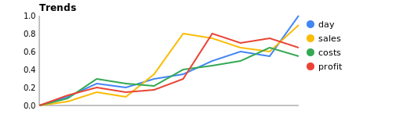
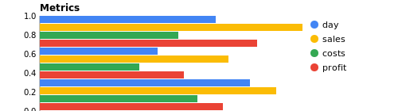
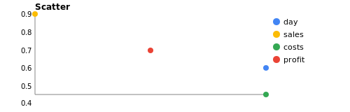
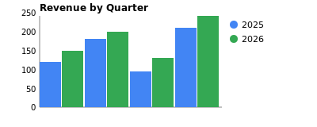
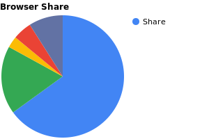
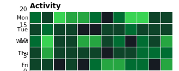
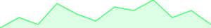

# qmochi 🍡

> **Incubating** — this package is developed in
> [hop-top/poly-kit](https://github.com/hop-top/poly-kit/tree/main/incubator/qmochi).
> Submit issues, PRs, and discussions there.

Terminal charting for Go. Built for
[Bubble Tea](https://github.com/charmbracelet/bubbletea).

High-density Unicode rendering with fractional blocks and
Braille characters. Value-oriented API — define, normalize,
render. Optional SVG output for embedding in docs/dashboards.

## Install

```
go get hop.top/qmochi
```

## Chart Types

| Type | Constant | Terminal | SVG | Description |
|------|----------|----------|-----|-------------|
| [Bar](#bar-chart) | `BarChart` | `RenderBar` | `RenderSVG` | Horizontal bars, per-series styles |
| [Column](#column-chart) | `ColumnChart` | `RenderColumn` | `RenderSVG` | Vertical columns, per-series styles |
| [Line](#line-chart) | `LineChart` | `RenderLine` | `RenderSVG` | Points connected by line segments |
| [Sparkline](#sparkline) | `SparklineChart` | `RenderSparkline` | `RenderSVG` | Ultra-compact single-row trend |
| [Heatmap](#heatmap) | `HeatmapChart` | `RenderHeatmap` | `RenderSVG` | 2D grid with color/shade intensity |
| [Braille](#braille-chart) | `BrailleChart` | `RenderLineBraille` | — | High-res 2D plotting (2x4 pixels) |
| [Scatter](#scatter-chart) | `ScatterChart` | `RenderScatter` | `RenderSVG` | X/Y scatter with distinct markers |
| [Pie](#pie-chart) | `PieChart` | `RenderPie` | `RenderSVG` | Circular proportions |

## Styles & Effects

Styles apply per-chart or per-series (`Series.Style`
overrides `Chart.Style`).

| Style | Constant | Glyphs | Used in |
|-------|----------|--------|---------|
| Solid | `SolidBlock` | `▏▎▍▌▋▊▉█` | [Bar](#bar-chart), [Column](#column-chart) |
| Dotted | `DottedBlock` | `· · · ·` | [Bar (patterned)](#per-series-styles) |
| Dashed | `DashedBlock` | `╶─╼╸━` | Bar, Column |
| Shaded | `ShadedBlock` | `░▒▓` | [Bar (patterned)](#per-series-styles) |
| Rounded | `RoundedBlock` | `▂▃▄▅▆▇█` | Column |

| Effect | Constant | Description | Used in |
|--------|----------|-------------|---------|
| Blink | `BlinkEffect` | Terminal blink | [Heatmap](#heatmap) |

| Field | Type | Description | Used in |
|-------|------|-------------|---------|
| `CellGlyph` | `string` | Override cell character | [Heatmap](#heatmap) |
| `Compact` | `bool` | Half-block vertical packing | [Heatmap](#heatmap) |
| `DomainMin` | `*float64` | Override Y-axis minimum | Bar, Column |

## Bar Chart

Horizontal bars with fractional-block precision.

```go
chart := qmochi.Chart{
    Type:  qmochi.BarChart,
    Title: "Project Velocity",
    Style: qmochi.ShadedBlock,
    Size:  qmochi.Size{Width: 55, Height: 6},
    Series: []qmochi.Series{{
        Name:  "Sprint 1",
        Color: "#40c463",
        Points: []qmochi.Point{
            {Label: "Tasks", Value: 45},
            {Label: "Bugs", Value: 12},
            {Label: "Reviews", Value: 28},
        },
    }},
}

ds, _ := qmochi.Normalize(chart)
ly := qmochi.LayoutFor(chart, ds)
fmt.Println(qmochi.RenderBar(chart, ds, ly))
```

```
Project Velocity
Tasks   ▓▓▓▓▓▓▓▓▓▓▓▓▓▓▓▓▓▓▓▓▓▓▓▓▓▓▓▓▓▓▓▓▓▓▓▓▓▓▓▓▓▓▓▓▓▓▓▓▓▓▓▓▓▓
Bugs    ▓▓▓▓▓▓▓▓▓▓▓▓▓▓
Reviews ▓▓▓▓▓▓▓▓▓▓▓▓▓▓▓▓▓▓▓▓▓▓▓▓▓▓▓▓▓▓▓▓▓░
```

### Per-series Styles

Each series can have its own block style, mimicking
pattern fills (solid, shaded, dotted, dashed):

```go
chart := qmochi.Chart{
    Type: qmochi.BarChart,
    Size: qmochi.Size{Width: 50, Height: 5},
    Series: []qmochi.Series{
        {Name: "day",    Style: qmochi.SolidBlock,  Points: ...},
        {Name: "sales",  Style: qmochi.ShadedBlock, Points: ...},
        {Name: "costs",  Style: qmochi.DottedBlock, Points: ...},
        {Name: "profit", Style: qmochi.DashedBlock, Points: ...},
    },
    ShowValues: true,
}
```

```
   day    ████████████████████████████████████ | 0.67
   sales  ▓▓▓▓▓▓▓▓▓▓▓▓▓▓▓▓▓▓▓▓▓▓▓▓▓▓▓▓▓▓▓▓▓▓▓▓▓▓▓▓▓▓▓▓▓▓▓▓▓▓ | 1.00
   costs  ·····························                          | 0.53
   profit ━━━━━━━━━━━━━━━━━━━━━━━━━━━━━━━━━━━━━━━━━━━           | 0.83
```

*Series.Style overrides Chart.Style. Unset = inherits
from chart.*

## Column Chart

Vertical columns. Supports all block styles.

```go
chart := qmochi.Chart{
    Type:  qmochi.ColumnChart,
    Title: "Weekly Revenue",
    Style: qmochi.DottedBlock,
    Size:  qmochi.Size{Width: 40, Height: 8},
    Series: []qmochi.Series{{
        Name:  "Revenue",
        Color: "#BD93F9",
        Points: []qmochi.Point{
            {Label: "Mon", Value: 120},
            {Label: "Tue", Value: 180},
            {Label: "Wed", Value: 95},
            {Label: "Thu", Value: 210},
            {Label: "Fri", Value: 165},
        },
    }},
}

ds, _ := qmochi.Normalize(chart)
ly := qmochi.LayoutFor(chart, ds)
fmt.Println(qmochi.RenderColumn(chart, ds, ly))
```

```
Weekly Revenue
                            ·
            ·               ·
            ·               ·       ·
            ·               ·       ·
    ·       ·               ·       ·
    ·       ·               ·       ·
    ·       ·       ·       ·       ·
```

## Line Chart

Sequential points connected by line segments.

```go
chart := qmochi.Chart{
    Type:  qmochi.LineChart,
    Title: "CPU Usage",
    Size:  qmochi.Size{Width: 45, Height: 7},
    Series: []qmochi.Series{{
        Name:  "Node 1",
        Color: "#FF5555",
        Points: []qmochi.Point{
            {Label: "00:00", Value: 25},
            {Label: "04:00", Value: 40},
            {Label: "08:00", Value: 78},
            {Label: "12:00", Value: 92},
            {Label: "16:00", Value: 65},
            {Label: "20:00", Value: 45},
        },
    }},
}

ds, _ := qmochi.Normalize(chart)
ly := qmochi.LayoutFor(chart, ds)
out, _ := qmochi.RenderLine(chart, ds, ly)
fmt.Println(out)
```

```
CPU Usage
                   ────────•
          ────────•        │
         │                  ────────•
 ────────•                           ───────•
│
•
```

## Sparkline

Ultra-compact trend in a single row.

```go
series := qmochi.Series{
    Color: "#50FA7B",
    Points: []qmochi.Point{
        {Value: 1}, {Value: 4}, {Value: 2}, {Value: 8},
        {Value: 5}, {Value: 3}, {Value: 7}, {Value: 6},
        {Value: 9}, {Value: 4}, {Value: 6}, {Value: 2},
    },
}

fmt.Println(qmochi.RenderSparkline(series, 30))
```

```
 ▄▂█▅▃▇▆█▄▆▂
```

## Heatmap

2D activity grid with GitHub-inspired green palette (color
mode) or `░▒▓█` shading (NoColor mode).

```go
chart := qmochi.Chart{
    Type:      qmochi.HeatmapChart,
    Title:     "GitHub Activity",
    XLabels:   xlabels,
    Series:    series,
    ShowYAxis: true,
    ShowXAxis: true,
}
```

```
GitHub Activity
Sun ▒░█▓▓▒ ▒██░░░▒░░  ░░▒░░░▒█░░▓▓░▒ ▒░▓░▓░░░░ ░░▒▒▒░░ ░
Mon  ▒▓▓▒▒ ▓░░░▓▒▒░ ▓░█▓▓▓░░▓░ ▓░▒▒░▒░▓░░░░▓░▓▓░▒░░▒░░▓▓
Tue  ▓░▓▒░▒▓▒▒▓░░░░░▒░█▒░▓▒░░░░░ ▓░░█░▒█▒▓░░▒▓░░▒░█░▒░░
Wed ░▒░█▓░░░▒▒░▓█▒░░░░░▓░▓▒░░░░█▓▒░░░▒▓░░▒░░░ ▒░░▓ ░▒▓▒░
Thu ░░▓░▒▓ █░░░░░▒ ▒▓░░▒░▓░░░▒▒░░▓▓░▒▓█▒▒▒░░▒░░  ▒ ░▒▒▒▓
Fri █▒ █▒▒░░░░░░▓▒▓░░▓▓▓▓░▒░░ ░▓ █▒░░▒▓░░░▒░▓░░░ ░░░▓▒█▓
Sat ▒░░░░░░▓█░█░░░░░░█ ░░░░░░░▒▒▒▒▒█▓░░▒▓░░ ▓░░░░▒░▒░▓░░
    May Jun Jul Aug Sep Oct Nov Dec Jan Feb Mar Apr
```

### Rendering modes

**Compact** — half-block `▄`/`▀`, cells touch all
directions:

```go
chart.Compact = true
```

**Spaced squares** — gaps between cells:

```go
chart.CellGlyph = "■ "
```

**Full blocks** — horizontal touch, vertical gaps (default).

## Scatter Chart

X/Y scatter plot with distinct markers per series.

```go
chart := qmochi.Chart{
    Type: qmochi.ScatterChart,
    Size: qmochi.Size{Width: 40, Height: 12},
    Series: []qmochi.Series{
        {
            Name:  "day",
            Color: "#4285F4",
            Points: []qmochi.Point{
                {X: 1, Value: 0.00},
                {X: 3, Value: 0.30},
                {X: 5, Value: 0.50},
                {X: 6, Value: 0.60},
            },
        },
        {
            Name:  "sales",
            Color: "#FBBC05",
            Points: []qmochi.Point{
                {X: 2, Value: 0.15},
                {X: 4, Value: 0.90},
            },
        },
        {
            Name:  "costs",
            Color: "#34A853",
            Points: []qmochi.Point{
                {X: 3, Value: 0.30},
                {X: 4, Value: 0.65},
                {X: 6, Value: 0.45},
            },
        },
        {
            Name:  "profit",
            Color: "#EA4335",
            Points: []qmochi.Point{
                {X: 2, Value: 0.00},
                {X: 3, Value: 0.75},
                {X: 5, Value: 0.70},
            },
        },
    },
    ShowYAxis:  true,
    ShowXAxis:  true,
    ShowLegend: true,
    NoColor:    true,
}

ds, _ := qmochi.Normalize(chart)
ly := qmochi.LayoutFor(chart, ds)
fmt.Println(qmochi.RenderScatter(chart, ds, ly))
```

```
     day=●  sales=○  costs=◆  profit=◇
1.00 │                    ○
     │        ◇               ◇
     │                ◆     ●
0.50 │            ●◆          ◆
     │    ●◆
     │        ○  ◆
0.00 │◇   ◆   ◇          ◇
     └────────────────────────────────
```

*Markers: `●○◆◇■□▲△` cycled per series. With color:
each series renders in its assigned color.*

## Braille Chart

High-resolution 2D plotting using Braille characters (2x4
dot patterns per cell).

```go
chart := qmochi.Chart{
    Type:  qmochi.BrailleChart,
    Title: "Signal Strength",
    Size:  qmochi.Size{Width: 45, Height: 6},
    Series: []qmochi.Series{{
        Name:  "dBm",
        Color: "#8BE9FD",
        Points: []qmochi.Point{
            {Label: "A", Value: 10},
            {Label: "B", Value: 30},
            {Label: "C", Value: 20},
            {Label: "D", Value: 45},
            {Label: "E", Value: 35},
            {Label: "F", Value: 50},
            {Label: "G", Value: 25},
            {Label: "H", Value: 40},
        },
    }},
}

ds, _ := qmochi.Normalize(chart)
ly := qmochi.LayoutFor(chart, ds)
out, _ := qmochi.RenderLineBraille(chart, ds, ly)
fmt.Println(out)
```

```
Signal Strength
⠀⠀⠀⠀⠀⠀⠀⠀⠀⠀⠀⠀⠀⠀⠀⠀⠀⠀⡀⠤⣀⠀⠀⠀⠀⠀⠀⠀⢀⠤⠐⠉⠂⢄⠀⠀⠀⠀⠀⠀⠀⠀⠀⠀⠀
⠀⠀⠀⠀⠀⠀⠀⠀⠀⠀⠀⠀⠀⠀⠀⠀⢀⠊⠀⠀⠀⠈⠑⠐⠤⡀⠔⠉⠀⠀⠀⠀⠀⠀⠑⢀⠀⠀⠀⠀⠀⢀⠠⠔⠈
⠀⠀⠀⠀⠀⡠⠒⠠⢄⢀⠀⠀⠀⢀⠠⠊⠀⠀⠀⠀⠀⠀⠀⠀⠀⠀⠀⠀⠀⠀⠀⠀⠀⠀⠀⠀⠑⠠⣀⠄⠒⠁⠀⠀⠀
⠀⠀⢀⠔⠁⠀⠀⠀⠀⠀⠉⠂⠢⠂⠀⠀⠀⠀⠀⠀⠀⠀⠀⠀⠀⠀⠀⠀⠀⠀⠀⠀⠀⠀⠀⠀⠀⠀⠀⠀⠀⠀⠀⠀⠀
⡠⠊⠀⠀⠀⠀⠀⠀⠀⠀⠀⠀⠀⠀⠀⠀⠀⠀⠀⠀⠀⠀⠀⠀⠀⠀⠀⠀⠀⠀⠀⠀⠀⠀⠀⠀⠀⠀⠀⠀⠀⠀⠀⠀⠀
```

## Pie Chart

Circular proportions with per-slice colors or distinct
glyphs in NoColor mode.

```go
chart := qmochi.Chart{
    Type:  qmochi.PieChart,
    Title: "Browser Share",
    Size:  qmochi.Size{Width: 30, Height: 10},
    Series: []qmochi.Series{{
        Name: "Share",
        Points: []qmochi.Point{
            {Label: "Chrome", Value: 65, Color: "#4285F4"},
            {Label: "Safari", Value: 18, Color: "#34A853"},
            {Label: "Firefox", Value: 3, Color: "#FBBC05"},
            {Label: "Edge", Value: 5, Color: "#EA4335"},
            {Label: "Other", Value: 9, Color: "#6272A4"},
        },
    }},
}

ds, _ := qmochi.Normalize(chart)
ly := qmochi.LayoutFor(chart, ds)
out, _ := qmochi.RenderPie(chart, ds, ly)
fmt.Println(out)
```

```
Browser Share

            ▚▚▚████
         ░░░▚▚▚███████
        ▓▓▒▒░░▚████████
        ▓▓▓▓▓▓░████████
        ▓▓▓▓▓▓█████████
        ▓▓▓████████████
         █████████████
            ███████
```

*Legend: █ Chrome · ▓ Safari · ▒ Firefox · ░ Edge · ▚ Other*

## SVG Output

Any chart type that supports SVG can render to `<svg>`
markup via `RenderSVG`. Same `Chart` + `Dataset`, different
output format.

```go
chart := qmochi.Chart{
    Type:       qmochi.LineChart,
    Title:      "Trends",
    Size:       qmochi.Size{Width: 650, Height: 120},
    ShowYAxis:  true,
    ShowXAxis:  true,
    ShowLegend: true,
    Series: []qmochi.Series{
        {Name: "day", Color: "#4285F4", Points: ...},
        {Name: "sales", Color: "#FBBC05", Points: ...},
        {Name: "costs", Color: "#34A853", Points: ...},
        {Name: "profit", Color: "#EA4335", Points: ...},
    },
}

ds, _ := qmochi.Normalize(chart)
svg := qmochi.RenderSVG(chart, ds)
os.WriteFile("chart.svg", []byte(svg), 0644)
```

```xml
<?xml version='1.0'?>
<svg xmlns='http://www.w3.org/2000/svg' width='650' height='120'>
  <polyline ... />
  <polyline ... />
  <polyline ... />
  <polyline ... />
</svg>
```

Supported: all chart types.

| Type | SVG element |
|------|-------------|
| Bar | `<rect>` horizontal bars |
| Column | `<rect>` vertical bars |
| Line | `<polyline>` paths |
| Scatter | `<circle>` points |
| Pie | `<path>` arc slices |
| Heatmap | `<rect>` color grid |
| Sparkline | `<polyline>` + `<path>` area fill |

### SVG Examples

| | |
|---|---|
|  |  |
|  |  |
|  |  |
|  | |

## Auto Chart Selection

`Auto` inspects data shape and picks the best chart type.
No configuration needed.

```go
data := []qmochi.Series{{
    Name: "Revenue",
    Points: []qmochi.Point{
        {Label: "Q1", Value: 100},
        {Label: "Q2", Value: 150},
        {Label: "Q3", Value: 120},
    },
}}

chart := qmochi.Auto(data) // → BarChart
```

| Data shape | Picks |
|-----------|-------|
| Any `Point.X` set | Scatter |
| 1 series, >20 pts, no labels | Sparkline |
| 1 series, ≤6 pts, sum ≈ 100 | Pie |
| ≥3 series, uniform cols ≥3 | Heatmap |
| Multi-series, >8 labels | Line |
| Multi-series, ≤8 labels | Column |
| 1 series, >8 labels | Line |
| Default | Bar |

### LLM-assisted (optional)

For ambiguous data, `AutoWithLLM` sends a compact data
summary to any `llm.Completer` and parses the response.
Falls back to deterministic `Auto` on error or
unrecognized response.

```go
provider, _ := llm.Resolve("ollama://llama3")
client := llm.NewClient(provider)

chart, _ := qmochi.AutoWithLLM(ctx, data, client)
```

Works with any provider — Ollama, Anthropic, OpenAI, etc.
Small models (llama3, gemma) handle this well since the
prompt is short and the answer is a single word.

## How It Works

```
data     → Auto(data)              → Chart (deterministic)
data     → AutoWithLLM(ctx, data, llm) → Chart (LLM-assisted)
Chart    → Normalize(chart)        → Dataset
Dataset  → Render*(chart, ds, ly)  → terminal string
Dataset  → RenderSVG(chart, ds)    → SVG markup
```

1. **Data**: raw series + points
2. **Auto**: pick chart type (or set manually)
3. **Normalize**: align series, fill gaps, validate
4. **Render**: terminal (`Render*`) or SVG (`RenderSVG`)

## Bubble Tea Integration

Stateful `Model` handles `tea.WindowSizeMsg` automatically.

```go
m := qmochi.NewModel(chart)

// In Update:
m, cmd = m.Update(msg)

// In View:
m.View().Content
```

Dynamic updates via messages:
- `qmochi.SetChartMsg` — replace chart config + data
- `qmochi.SetSizeMsg` — override dimensions

## Normalization Rules

1. Preserves series order, style, color, effect
2. First-seen label order across all series
3. Zero-fills missing values
4. Rejects empty series names / duplicate labels
5. Scatter charts skip label validation (uses X field)

## License

MIT
